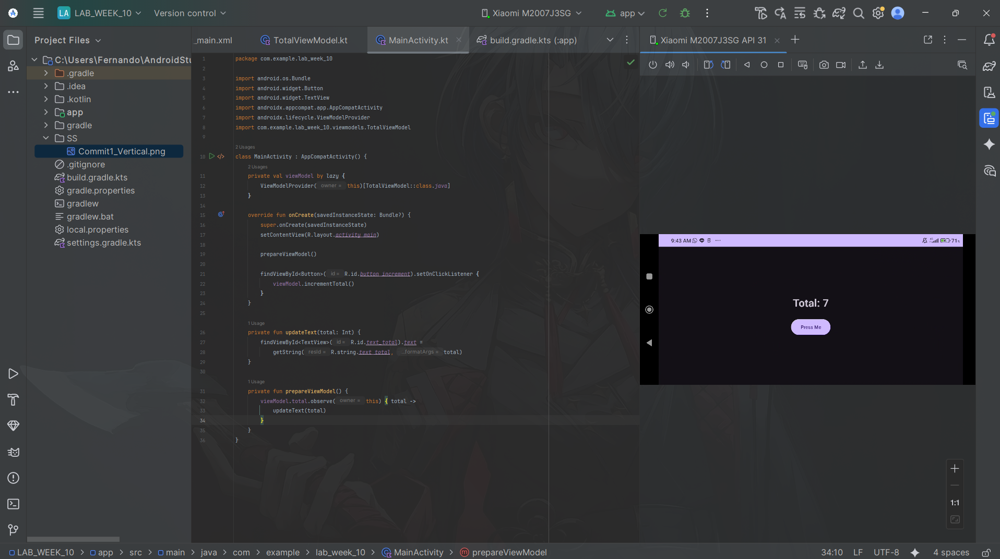
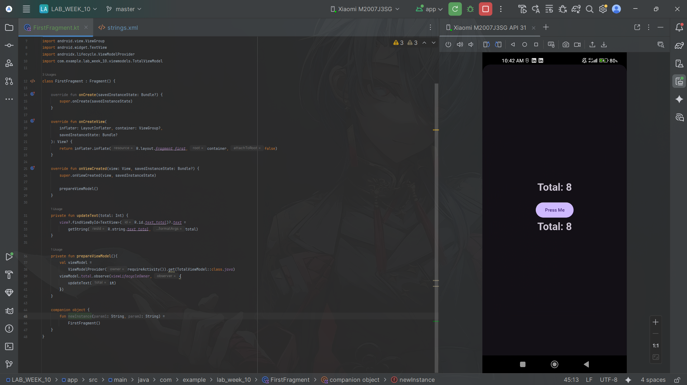
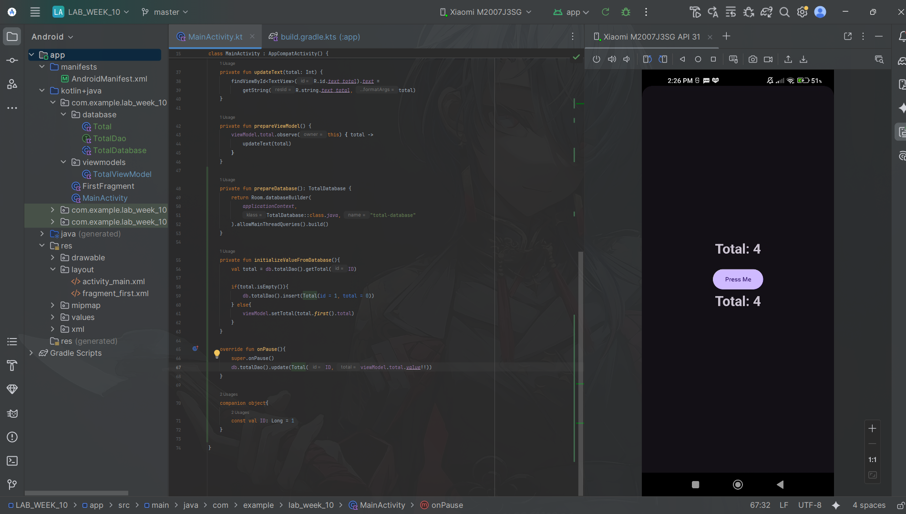
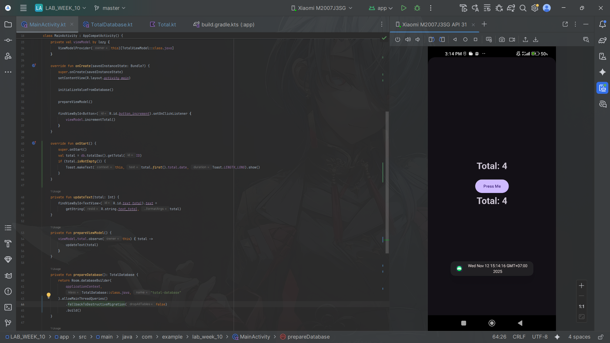

### Submitted by:
* **Nama:** Fernando Sunarto
* **NIM:** 00000083441
* **Class:** AL
---

# LAB_WEEK_10 - Android Architecture Components

## Project Overview
This project demonstrates the implementation of Android Jetpack components including ViewModel, LiveData, and Room Database to build a counter application that persists data across configuration changes and app restarts.

---

### Project Files
| Commit | Description | APK Download | Screenshot Preview |
| :---: |---------------------------------------------|:---:|:---:|
| **01** | **Implement ViewModel to Handle Rotation (Horizontal)** | [📱 Download APK](apps/Commit1_Android_Package_Kit.apk) | |
| **01** | **Implement ViewModel to Handle Rotation (Vertical)** | [📱 Download APK](apps/Commit1_Android_Package_Kit.apk) | |
| **02** | **Implement LiveData to Sync Activity and Fragment UI** | [📱 Download APK](apps/Commit2_Android_Package_Kit.apk) | |
| **03** | **Integrate Room Database for Data Persistence** | [📱 Download APK](apps/Commit3_Android_Package_Kit.apk) | |
| **04** | **Complete Bonus Assignment (Add Update Timestamp)** | [📱 Download APK](apps/Commit4_Android_Package_Kit.apk) | |

---

### Code that Changed for Assignment
1. Change Database Version into 2
```diff
- @Database(entities = [Total::class], version = 1)
# To
+ @Database(entities = [Total::class], version = 2)
```

2. In Total.kt:
```diff
  import androidx.room.ColumnInfo
+ import androidx.room.Embedded
  import androidx.room.Entity
  import androidx.room.PrimaryKey

  data class Total(
      @PrimaryKey(autoGenerate = true)
      @ColumnInfo(name = "id")
      val id: Long = 0,
-      val total: Int = 0,

+     @Embedded val total: TotalObject
+ )

+ data class TotalObject(
+   @ColumnInfo(name = "value") val value: Int,
+   @ColumnInfo(name = "date") val date: String
+ )
```

3. MainActivity:
```diff
+  override fun onStart() {
+        super.onStart()
+        val total = db.totalDao().getTotal(ID)
+        if (total.isNotEmpty()) {
+            Toast.makeText(this, total.first().total.date, Toast.LENGTH_LONG).show()
+        }
+   }
```

```diff
# From
-  ).allowMainThreadQueries().build()
# To
+  ).allowMainThreadQueries()
            .fallbackToDestructiveMigration(false)
            .build()
```

```diff
# From
-   db.totalDao().insert(Total(id = 1, total = 0))
# To
+  db.totalDao().insert(Total(id = 1, total = TotalObject(0, Date().toString())))
```

```diff
# From
-  viewModel.setTotal(total.first().total)
# To
+  viewModel.setTotal(total.first().total.value)
```

```diff
# From
-  db.totalDao().update(Total(ID, viewModel.total.value!!))
# To
+  db.totalDao().update(Total(ID, TotalObject(viewModel.total.value!!, Date().toString())))
```
